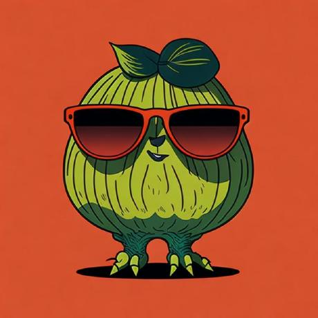
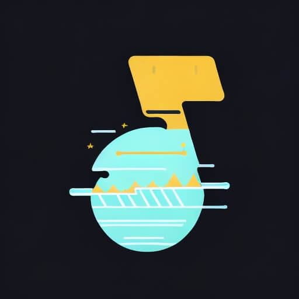

# Aidaole's Blog

## 学习并记录自己的一些知识，总结和感想

> 欢迎学习交流和指正

  <a href="/android/aimusic.md" class="card">
    
    
开始阅读

  </a>
  <a href="/algorithm/README.md" class="card">
    
    
算法刷起来

  </a>
  <a href="https://github.com/aidaole/AiMusic" class="card">
    
开源

    
    
AiMusic应用

  </a>
  <a href="https://github.com/aidaole/EasyLaunch" class="card">
    
开源

    
    
EasyLaunch框架

  </a>

<!-- 自定义样式 -->

<!--  -->
