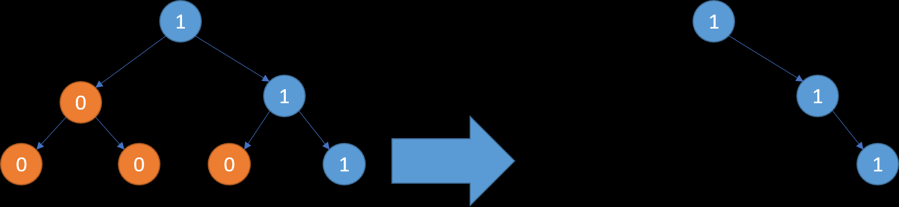

# leetcode 47.二叉树剪枝

给定一个二叉树 根节点 root ，树的每个节点的值要么是 0，要么是 1。请剪除该二叉树中所有节点的值为 0 的子树。

节点 node 的子树为 node 本身，以及所有 node 的后代。

例子：



**思路：**

1. 写一个函数，求以当前节点为root，下面所有节点和。如果当前和为0，则说明此节点应该被裁剪
2. 如果正向计算从头开始，那计算子节点就是重复计算。所以应该从子节点开始计算，依次向上

```java
class Solution {
    public TreeNode pruneTree(TreeNode root) {
        if(root == null) return root;
        // 先从子节点开始裁剪，自底向上
        pruneTree(root.left);
        pruneTree(root.right);
        // 如果当前节点的左子树和为0，则删除左边
        if(calSum(root.left) == 0){
            root.left = null;
        }
        // 如果当前节点的右子树和为0，则删除右边
        if(calSum(root.right) == 0){
            root.right = null;
        }
        // 如果当前root为0，这删除当前节点
        if(calSum(root) == 0){
            return null;
        }
        return root;
    }

    // 计算当前节点下面的所有和
    public int calSum(TreeNode root) {
        if(root == null) return 0;
        int sum = root.val + calSum(root.left) + calSum(root.right);
        return sum;
    }
}
```

