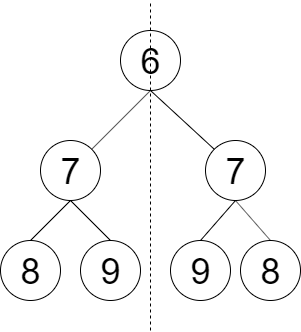

# leetcode 145. 判断对称二叉树

请设计一个函数判断一棵二叉树是否 轴对称 。



**思路**

要判断一个树是否对称，可以先想想 怎么判断两棵树是否相同。
如果两棵树相同知道，怎么判断两棵树是否是镜像树。那么如果自己
跟自己是镜像树，那这棵树就是轴对称的。

```java
class Solution {
    public boolean checkSymmetricTree(TreeNode root) {
        return checkTree(root, root);
    }

    // 判断两棵树是否是镜像树
    public boolean checkTree(TreeNode left, TreeNode right){
        if(left == null && right == null){
            return true;
        }
        if(left == null || right == null){
            return false;
        }
        return left.val == right.val
            && checkTree(left.left, right.right)
            && checkTree(left.right, right.left);
    }
}
```