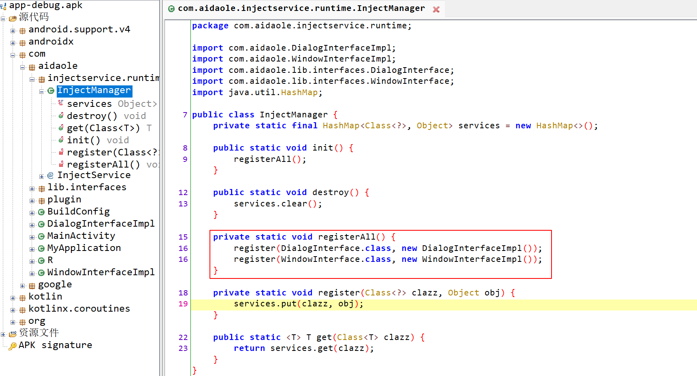

# ASM实战注入框架

这篇文章主要介绍通过 `gradle transform` 流程，扫描注解和接口实现类，将实现类和接口自动注入，使得模块间不通过 `module` 依赖实现访问其他模块接口的能力。主要解决组件化项目中，同级模块不能依赖但是想相互调用的问题，避免循环依赖。

也是记录怎么使用 `transform` 和发布插件的完整流程，主要内容如下：

1. 怎么定义注解，在 `transform` 过程中扫描注解，并记录
2. 根据注解内容，通过 `ASM` 插入注册代码
3. 发布插件并使用

## 1. 介绍项目结构

```
app
  |
  +-modules         // 业务层
  |   |
  |   +- module1    // 业务模块1
  |   |
  |   +- module2    // 业务模块2
  |
  +-injectservice
  |   |
  |   +-injectservice_plugin  // 插件实现
  |   |
  |   +-injectservice_runtime // 插件runtime
  |  
  +-base
      |
      +-lib_interface         // 定义接口 
```
主要功能就是 `module2` 不通过依赖 `module1` 来实现访问 `mdoule1` 的接口实现，模块间交互的接口都放在 `lib_interface` 中

## 2. 使用方法

请参考详细步骤 [https://github.com/aidaole/InjectService](https://github.com/aidaole/InjectService)

## 3. 原理介绍

### 3.1 入口

主要入口是在插件 `runtime` 中 `InjectManager`

```java
public class InjectManager {
    private static final HashMap<Class<?>, Object> services = new HashMap<>();

    // 初始化
    public static void init() {
        registerAll();
    }

    // 注册所有方法
    private static void registerAll(){}

    public static void destroy(){
        services.clear();
    }


    private static void register(Class<?> clazz, Object obj) {
        services.put(clazz, obj);
    }

    public static <T> T get(Class<T> clazz) {
        return (T) services.get(clazz);
    }
}
```

所有的接口和实现都是在 `InjectManager` 中通过 `Map` 保存的，在项目初始化时需要调用 `init` 方法，注册所有的接口。这里看到 `registerAll` 还是一个空方法。我们编写注解和transofrm的目的就是为了将找到的接口和实现通过asm写入到 `registerAll` 方法中

### 3.2 定义transform

怎么定义 gradle 插件，由于篇幅这里我们就不介绍了，如果不清楚可以参考 [https://aidaole.github.io/#/other/tinypng_plugin](https://aidaole.github.io/#/other/tinypng_plugin)

plugin中注册2个 `transform` 任务
```kotlin
class InjectServicePlugin : Plugin<Project> {
    override fun apply(project: Project) {
        println("InspectServicePlugin start")
        val appExtension = project.extensions.findByType(AppExtension::class.java)
        appExtension?.registerTransform(InjectServiceTransform()) // 扫描所有的注解
        appExtension?.registerTransform(InjectManagerCreateTransform()) // 通过注解织入代码
        println("InspectServicePlugin end")
    }
}
```

`transform` 的基本流程就是扫描`项目中的所有代码`以及引入`jar包中的字节码`找到自己想要的信息然后通过`visitor`做处理

这里抽象了一个 `BaseTransofrm` 做基础流程（

```kotlin
abstract class BaseTransform : Transform() {
    
    override fun getInputTypes(): MutableSet<QualifiedContent.ContentType> {
        return TransformManager.CONTENT_CLASS
    }
  
    override fun getScopes(): MutableSet<in QualifiedContent.Scope> {
        return TransformManager.SCOPE_FULL_PROJECT
    }

    override fun isIncremental(): Boolean = false

    // 主要流程
    override fun transform(transformInvocation: TransformInvocation) {
        super.transform(transformInvocation)
        val outProvider = transformInvocation.outputProvider
        transformInvocation.inputs.forEach { input ->
            // 处理jar包
            input.jarInputs.forEach { jarInput ->
                processJarInput(jarInput, outProvider)
            }
            // 处理代码
            input.directoryInputs.forEach { directoryInput ->
                processDirectoryInput(directoryInput, outProvider)
            }
        }
    }

    // 处理jar包中的class
    private fun processJarInput(jarInput: JarInput, outProvider: TransformOutputProvider) {
        val dest = outProvider.getContentLocation(
            jarInput.file.absolutePath,
            jarInput.contentTypes,
            jarInput.scopes,
            Format.JAR
        )
        val jarFile = JarFile(jarInput.file)
        val jarOutputStream = JarOutputStream(dest.outputStream())
        for (entry in jarFile.entries()) {
            val entryInputStream = jarFile.getInputStream(entry)
            val newEntry = JarEntry(entry.name)
            jarOutputStream.putNextEntry(newEntry)

            val bytesRead = entryInputStream.readAllBytes()
            if (entry.name.endsWith(".class")) {
                val processedBytes = processClass(bytesRead)
                jarOutputStream.write(processedBytes)
            } else {
                jarOutputStream.write(bytesRead)
            }

            jarOutputStream.closeEntry()
            entryInputStream.close()
        }
        jarOutputStream.close()
    }

    // 处理自己项目中的class
    private fun processDirectoryInput(directoryInput: DirectoryInput, outProvider: TransformOutputProvider) {
        val dest = outProvider.getContentLocation(
            directoryInput.name,
            directoryInput.contentTypes,
            directoryInput.scopes,
            Format.DIRECTORY
        )

        if (directoryInput.file.isDirectory) {
            FileUtils.getAllFiles(directoryInput.file).forEach { file ->
                val filename = file.name
                val fileInputStream = file.inputStream()
                val readBytes = fileInputStream.readAllBytes()
                fileInputStream.close()

                val filePath = file.parentFile.absolutePath + File.separator + filename
                val fos = FileOutputStream(filePath)
                if (filename.endsWith(".class")) {
                    val processedBytes = processClass(readBytes)
                    fos.write(processedBytes)
                } else {
                    fos.write(readBytes)
                }
                fos.close()
            }
        }

        FileUtils.mkdirs(dest)
        FileUtils.copyDirectory(directoryInput.file, dest)
    }

    // 将class丢给visitor处理，具体visitor子类实现
    private fun processClass(inputBytes: ByteArray): ByteArray {
        val reader = ClassReader(inputBytes)
        val writer = ClassWriter(reader, ClassWriter.COMPUTE_MAXS)
        val visitor = getClassVisitor(writer)
        reader.accept(visitor, ClassReader.EXPAND_FRAMES)
        return writer.toByteArray()
    }

    // 子类实现的visitor
    abstract fun getClassVisitor(writer: ClassWriter): ClassVisitor
}
```

扫描所有接口任务 `InjectServiceTransform`

```kotlin
class InjectServiceTransform : BaseTransform() {
    // ...

    override fun getClassVisitor(writer: ClassWriter): ClassVisitor {
        return InspectServiceClassVisitor(writer)
    }
}
```

通过 `InspectServiceClassVisitor` 访问注解了 `Lcom/aidaole/injectservice/runtime/InjectService;` 的class，并添加到 `InjectImplManager` 中

```kotlin
class InspectServiceClassVisitor(visitor: ClassVisitor) : ClassVisitor(Opcodes.ASM6, visitor) {
    companion object {
        private const val TAG = "InspectServiceClassVisitor"
        const val INSPECT_SERVICE_NAME = "Lcom/aidaole/injectservice/runtime/InjectService;"
    }

    private var needHook = false
    private var className = ""

    override fun visit(
        version: Int,
        access: Int,
        name: String,
        signature: String?,
        superName: String?,
        interfaces: Array<out String>?
    ) {
        className = name
        super.visit(version, access, name, signature, superName, interfaces)
    }

    override fun visitAnnotation(descriptor: String?, visible: Boolean): AnnotationVisitor {
        // 匹配注解
        if (descriptor == INSPECT_SERVICE_NAME) {
            needHook = true
            return AnnotationValueVisitor(api, super.visitAnnotation(descriptor, visible), className)
        } else {
            return super.visitAnnotation(descriptor, visible)
        }
    }

    private class AnnotationValueVisitor(api: Int, av: AnnotationVisitor?, val className: String) :
        AnnotationVisitor(api, av) {
        override fun visit(name: String, value: Any) {
            // 添加到收集器中
            InjectImplManager.addClass(className, value.toString())
            "find interface: $className,  key:$name -> value:$value".logi(TAG)
            super.visit(name, value)
        }
    }
}
```

`InjectImplManager`就是保存`实现类类名`和`接口名的映射`

```kotlin
object InjectImplManager {
    private var classPoll = mutableListOf<Pair<String, String>>()

    fun addClass(implName: String, interfaceName: String) {
        classPoll.forEach { pair->
            if (pair.first == implName && pair.second == interfaceName) {
                return
            }
        }
        classPoll.add(Pair(implName, interfaceName))
    }

    fun getAllImpls(): MutableList<Pair<String, String>> {
        return classPoll
    }
}
```

扫描完之后，就要通过asm植入代码。主要通过 `InjectManagerCreateTransform` 实现

```kotlin
class InjectManagerCreateTransform : BaseTransform() {
    // ...
    override fun getClassVisitor(writer: ClassWriter): ClassVisitor {
        return InjectManagerClassVisitor(writer)
    }
}
```

通过visitor，找到 `com/aidaole/injectservice/runtime/InjectManager` 的 `registerAll` 方法，然后通过 `InjectManagerMethodVisitor` 插入代码

```kotlin
class InjectManagerClassVisitor(visitor: ClassVisitor, val classPath: String = "") :
    ClassVisitor(Opcodes.ASM6, visitor) {
    companion object {
        private const val TAG = "InjectManagerClassVisitor"
        public const val INSPECT_MANAGER_NAME = "com/aidaole/injectservice/runtime/InjectManager"
    }

    private var needHook = false
    private var className = ""

    override fun visit(
        version: Int,
        access: Int,
        name: String,
        signature: String?,
        superName: String?,
        interfaces: Array<out String>?
    ) {
        className = name
        if (className == INSPECT_MANAGER_NAME) {
            "find manager: $name".logi(TAG)
            needHook = true
        }
        super.visit(version, access, name, signature, superName, interfaces)
    }

    override fun visitMethod(
        access: Int,
        name: String?,
        descriptor: String?,
        signature: String?,
        exceptions: Array<out String>?
    ): MethodVisitor {
        var methodVisitor = super.visitMethod(access, name, descriptor, signature, exceptions)
        if (needHook) {
            if (name == "registerAll") {
                "find method: $name, $descriptor".logi(TAG)
                methodVisitor = InjectManagerMethodVisitor(api, methodVisitor)
            }
        }
        return methodVisitor
    }
}
```

`InjectManagerMethodVisitor`中获取之前`InjectImplManager`中保存的记录，并且通过 `asm` 插入

```kotlin
class InjectManagerMethodVisitor(
    api: Int,
    methodVisitor: MethodVisitor
) : MethodVisitor(api, methodVisitor) {
    companion object {
        private const val TAG = "InjectManagerMethodVisitor"
    }

    override fun visitInsn(opcode: Int) {
        insertRegisterMethod(opcode, this, InjectImplManager.getAllImpls())
        super.visitInsn(opcode)
    }

    // 获取之前 InjectImplManager 中保存的记录，执行插入
    private fun insertRegisterMethod(
        opcode: Int,
        methodVisitor: MethodVisitor,
        allImpls: MutableList<Pair<String, String>>
    ) {
        if (opcode == Opcodes.ARETURN || opcode == Opcodes.RETURN) {
            allImpls.forEach { item ->
                doInsertRegister(item.first, item.second, opcode, methodVisitor)
            }
        }
    }

    // 通过asm插入代码
    private fun doInsertRegister(implName: String, interfaceName: String, opcode: Int, methodVisitor: MethodVisitor) {
        "doInsertRegister: $implName, $interfaceName".logi(TAG)
        methodVisitor.visitLdcInsn(Type.getType(interfaceName));
        methodVisitor.visitTypeInsn(Opcodes.NEW, implName);
        methodVisitor.visitInsn(Opcodes.DUP);
        methodVisitor.visitMethodInsn(Opcodes.INVOKESPECIAL, implName, "<init>", "()V", false)
        methodVisitor.visitMethodInsn(
            Opcodes.INVOKESTATIC,
            InjectManagerClassVisitor.INSPECT_MANAGER_NAME,
            "register",
            "(Ljava/lang/Class;Ljava/lang/Object;)V",
            false
        )
    }
}
```

### 3.3 运行流程和产物

原理就讲解的差不多了，再通过日志看一下插件具体执行的流程。通过日志看流程非常清晰:
1. 找到的接口和实现类
2. 找到runtime中的InjectManager
3. 找到registerAll方法
4. 执行植入代码

```
> Task :app:transformClassesWithInspectServiceTransformForDebug
InspectServicePlugin>     +-----------------------------+   
InspectServicePlugin>     |                             |   
InspectServicePlugin>     |    InspectServiceTransform  |   
InspectServicePlugin>     |                             |   
InspectServicePlugin>     +-----------------------------+   
// 找到的接口和实现类
InspectServiceClassVisitor>  find interface: com/aidaole/DialogInterfaceImpl,  key:value -> value:Lcom/aidaole/lib/interfaces/DialogInterface;
InspectServiceClassVisitor>  find interface: com/aidaole/WindowInterfaceImpl,  key:value -> value:Lcom/aidaole/lib/interfaces/WindowInterface;

> Task :app:mergeDebugJavaResource

> Task :app:transformClassesWithInjectManagerCreateTransformForDebug
InspectServicePlugin>     +-----------------------------+   
InspectServicePlugin>     |                             |   
InspectServicePlugin>     | InjectManagerCreateTransform|   
InspectServicePlugin>     |                             |   
InspectServicePlugin>     +-----------------------------+   
// 找到runtime中的InjectManager
InjectManagerClassVisitor>  find manager: com/aidaole/injectservice/runtime/InjectManager
// 找到方法
InjectManagerClassVisitor>  find method: registerAll, ()V
// 执行植入代码
InjectManagerMethodVisitor>  doInsertRegister: com/aidaole/DialogInterfaceImpl, Lcom/aidaole/lib/interfaces/DialogInterface;
InjectManagerMethodVisitor>  doInsertRegister: com/aidaole/WindowInterfaceImpl, Lcom/aidaole/lib/interfaces/WindowInterface;
```

看一下反编译apk中的代码



