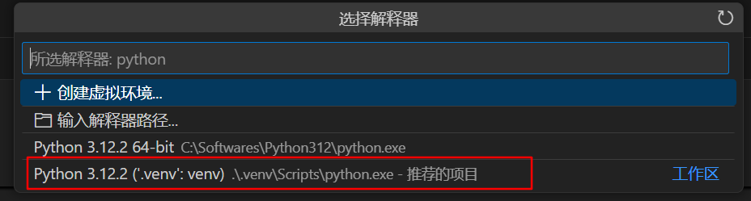
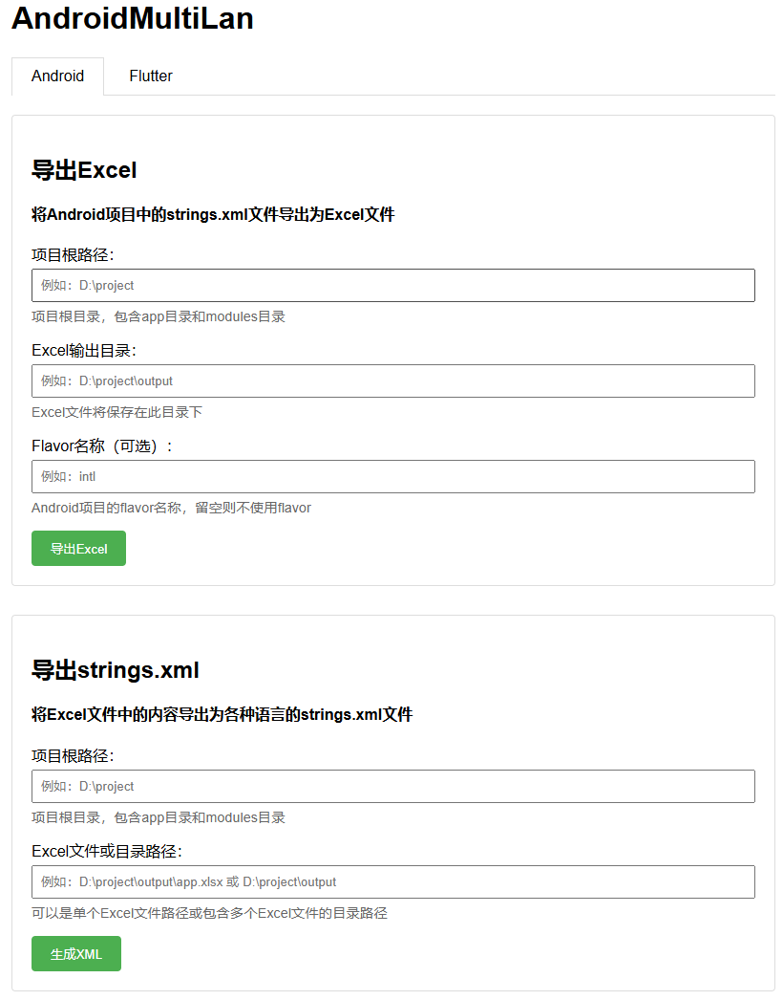
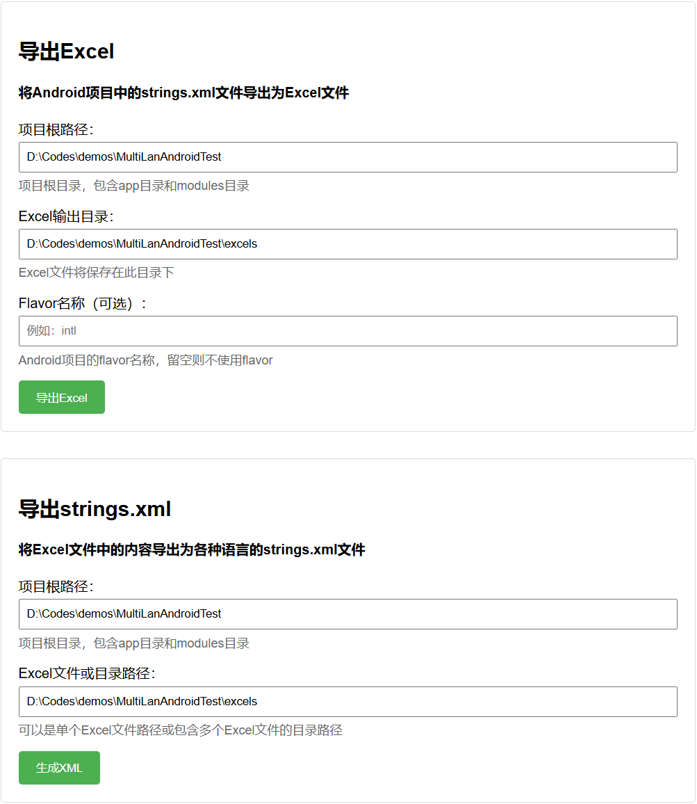
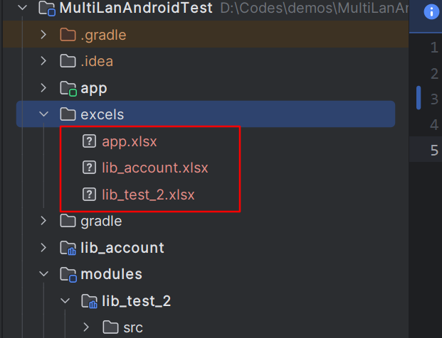
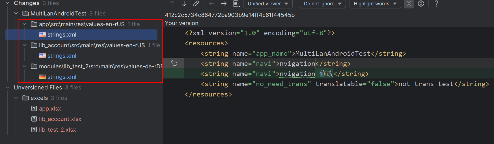

# AndroidMultiLan

android中我们适配多语言是在 `values-xxx` 目录中创建对应语言的 `string.xml`

大公司有自己成熟的多语言适配工具，但是对于小公司可能没有资源来建立一套完整的多语言系统。

下文中提供了一个简洁的多语言适配工具，其功能包括:

1. 将我们项目中的 `string.xml` 整合到一个 `excel` 表格中（此时可以拿表格去给翻译公司翻译）
2. 将 `excel` 文件导出对应国家语言的 `string.xml`

工具的优势:

1. 要适配一个完整国家语言时, 可以非常快捷的知道哪些 `key` 需要翻译, 一键导出列表
2. 翻译完成之后, 不需要手动一个一个根据 `key` 替换到对应的 `string.xml` 中, 避免出错

项目地址: [https://github.com/aidaole/AndroidMultiLan](https://github.com/aidaole/AndroidMultiLan)

## 使用说明

### 脚本功能主要分为2个部分:

1. `strings.xml` 导出excel: **export_excel.py**
2. excel 导出对应国家语言列表 `strings.xml`: **export_xml.py**

### 环境配置

首先安装python环境, 目前python的版本是3.12.4

项目中提供了 `requirements.txt` 文件, 可以方便的安装所有需要的python包

```bash
pip install -r requirements.txt
```

当然最好是使用 python 虚拟环境 virtualenv 来安装这些包

```bash
python -m venv .venv
.venv\Scripts\activate
pip install -r requirements.txt
```
在vscode中激活python虚拟环境



### 运行

* 运行程序

```bash
python ./app.py
```

* 可以看到启动成功日志

```bash
* Serving Flask app 'app'
 * Debug mode: on
WARNING: This is a development server. Do not use it in a production deployment. Use a production WSGI server instead.
 * Running on all addresses (0.0.0.0)
 * Running on http://127.0.0.1:5000
 * Running on http://192.168.31.175:5000
Press CTRL+C to quit
 * Restarting with stat
 * Debugger is active!
 * Debugger PIN: 177-914-879
```

* 访问网页



### 使用方式

#### 导出excel

1. 导出excel, 填写项目根目录, 会自动读取包括app和modules目录下的所有strings.xml文件, 并导出为excel
2. 导出时支持填写flavor名称, 默认读取跟`main`同级的flavor目录
3. 合成时会将main下的`values/strings.xml`(作为默认文件)和flavor目录下的strings.xml文件合并, 并导出为excel
4. 导出每个module为单独的excel文件
5. 支持 transable=false 属性, 导出时会过滤对应字符串


#### 导出strings.xml

导出xml功能基本就是与excel相反, 会将excel中每一列作为一种单独的语言导出到对应values-xxx/strings.xml文件中

1. 填写项目根目录, 会自动读取包括app和modules目录下的所有strings.xml文件, 并导出为excel
2. 导出时支持填写flavor名称, 默认读取跟`main`同级的flavor目录
3. 导出时按照原xml中顺序按key覆盖对应value, 不是以excel中的顺序覆盖, 最大程度上避免git diff出来行对不上的问题

### 使用实例

例如我有一个android项目, 目录和module如下:

```
AndroidMultiLanTest
    |--app
        |--values
            |--strings.xml
        |--values-en-US
            |--strings.xml
        |--values-de-DE
            |--strings.xml
    |--lib_account
        |--values
            |--strings.xml
        |--values-en-US
            |--strings.xml
    |--modules
        |--lib_test_2
            |--values
                |--strings.xml
                    |--values-en-US
            |--strings.xml
```



导出excel后的效果如下:



将excel中的文本修改之后, 反向生成xml, 查看git diff:



# 对Flutter的支持

其实这个工具还适配了flutter项目的多语言导出和导入, 使用方法类似于android, 只不过需要导出`arb`文件, 然后导入`arb`文件

依然是填写flutter项目的根目录, 会自动识别flutter项目中 `lib/l10n` 目录下的所有 `arb` 文件, 并导出为excel, 当然你flutter的多语言方案必须使用 `flutter_localizations` 的方案

这里就不多做介绍, 可以自行尝试