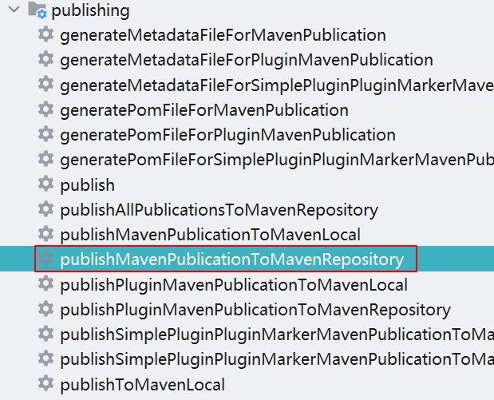
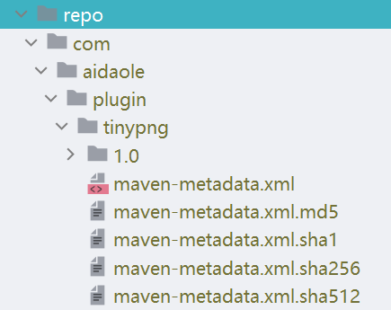
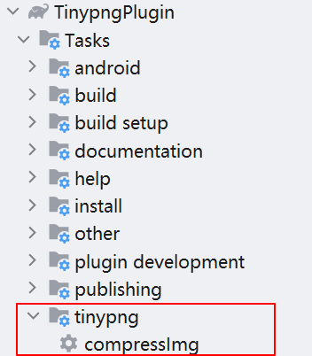

# 图片压缩插件

在android开发中，对包体积的优化有很多方法，通常图片在包体积中会占很大一部分。通常我们会使用更小的图片如: webp, .9.png, svg 等方式减少资源的大小，对于一些不可避免的 .png, .jpg 图片通常会采用压缩的方式来减少其体积。

目前主流的方法就是将项目中的所有图片都找出来，然后放到 [Tinypng](https://tinypng.com/) 或者用其他压缩工具压缩之后，再替换掉项目中的图片。这个流程如果人工操作其实比较繁琐，而且也容易出错。所以这里通过编写 `gradle plugin` 的方式编写脚本，来达到一键压缩项目中所有图片并替换的功能。

这篇文章主要记录：

1. 如何编写gradle插件
2. 怎么通过extensions读取外部配置，应用到插件中
3. 怎么发布一个gradle插件
4. 提供一个好用的图片压缩批量插件

可以直接看代码，Github源码地址：[TinypngPlugin](https://github.com/aidaole/TinypngPlugin)

## 1. 创建gradle插件

创建一个 java library: `tinypng_plugin`

修改 `tinypng_plugin` 的 build.gradle 文件

```gradle
plugins {
    id "kotlin"
    id "java-gradle-plugin"
    id "maven-publish"
}

dependencies {
    implementation(gradleApi())
    implementation(localGroovy())
    compileOnly("com.android.tools.build:gradle:7.2.1")
    implementation("com.tinify:tinify:1.8.3")
}

// 配置gradle插件，自动生成插件入口
gradlePlugin {
    plugins {
        simplePlugin {
            // apply plugin: 此id
            id = "com.aidaole.plugin.tinypng"
            // 这个类路径需要指向插件的入口类
            implementationClass = "com.aidaole.plugin.imgcompress.TingpngPluginImpl"
        }
    }
}

// maven publish 发布插件使用
afterEvaluate {
    publishing {
        repositories {
            maven {
                // 本地目录，项目根目录的 repo 文件夹
                url = "../repo"
            }
        }
        publications {
            maven(MavenPublication) {
                // {groupId:artifactId:version} 为buildScript 中依赖的 classpath 插件地址
                groupId = 'com.aidaole.plugin'
                artifactId = 'tinypng'
                version = '1.0'
                from components.java
            }
        }
    }
}
```

## 2. 创建Plugin入口

创建Plugin实现类入口 **TingpngPluginImpl.kt**

代码中个主要包含
1. extensions 中参数的读取
2. 通过代码添加一个 task

```kt
class TingpngPluginImpl : Plugin<Project> {
    override fun apply(project: Project) {
        log("config plugin start")
        // 注册插件的extensions配置
        val config = project.extensions.create("tinypngConfig", TinypngConfig::class.java)
        // 创建图片压缩的task, 其中 apiKey 和 imgTypes 参数通过 extensions 中的配置读取
        project.tasks.register("compressImg") { compressTask ->
            compressTask.group = "tinypng"
            compressTask.doLast {
                val apiKey = config.apiKey ?: ""
                val imgTypes = config.imgTypes ?: ""
                log("apiKey: $apiKey")
                log("imgTypes: $imgTypes")
                log("root: ${project.rootProject.rootDir.absolutePath}")

                val tinyPng = Tinypng(apiKey, imgTypes)
                tinyPng.compressAllFile(project.rootProject.rootDir.absolutePath)
            }
        }
        log("config plugin end")
    }
}
```

配置类 **TinypngConfig.java**

```java
public class TinypngConfig {
    public String apiKey = "";
    public String imgTypes = "";

    public TinypngConfig() {
    }

    public TinypngConfig(String apiKey, String imgTypes) {
        this.apiKey = apiKey;
        this.imgTypes = imgTypes;
    }

    public String getApiKey() {
        return apiKey;
    }

    public void setApiKey(String apiKey) {
        this.apiKey = apiKey;
    }

    public String getImgTypes() {
        return imgTypes;
    }

    public void setImgTypes(String imgTypes) {
        this.imgTypes = imgTypes;
    }
}
```

## 3. 具体的压缩、替换图片实现

```kt
class Tinypng(private val apiKey: String, private val imgTypesStr: String) {

    private val imgTypes = mutableSetOf(".png", ".jpg", ".jepg")

    init {
        Tinify.setKey(apiKey)
        if (imgTypesStr.isNotEmpty()) {
            imgTypes.clear()
            imgTypes.addAll(imgTypesStr.split("|"))
        }
        log("imageTypes: $imgTypes")
    }

    // 递归所有图片
    fun compressAllFile(filePath: String) {
        if (filePath.isExcludeFile()) {
            return
        }
        val root = File(filePath)
        if (root.isDirectory) {
            root.listFiles()?.forEach { item ->
                compressAllFile(item.toString())
            }
        } else {
            compressFile(filePath, filePath)
        }
    }

    // 调用api压缩图片
    private fun compressFile(fromFile: String, toFile: String) {
        if (fromFile.isInImgTypes() && !fromFile.endsWith(".9.png")) {
            val imgBitDepth = getImgBitDepth(fromFile)
            if (imgBitDepth > 16) {
                log("compress:${fromFile}, imgBitDepth: $imgBitDepth")
                try {
                    Tinify.fromFile(fromFile).toFile(toFile)
                } catch (e: Exception) {
                    log("error: $e")
                }
            } else {
                log("not compress:${fromFile}")
            }
        }
    }

    // 是否是要压缩的类型
    private fun String.isInImgTypes(): Boolean {
        imgTypes.forEach { imgSuffix ->
            if (this.endsWith(imgSuffix)) {
                return true
            }
        }
        return false
    }

    // 获取图片位深度，避免重复压缩
    private fun getImgBitDepth(imgPath: String): Int {
        val pngFile = File(imgPath)
        val fis = FileInputStream(pngFile)
        var depth = 0
        fis.use {
            val sourceImg = ImageIO.read(fis)
            depth = sourceImg.colorModel.pixelSize
        }
        return depth
    }

    // 排除不需要扫描的目录
    private fun String.isExcludeFile(): Boolean {
        if ((contains("build")) || contains("intermediates") || contains(".gradle")) {
            return true
        }
        return false
    }
}
```

## 4. 发布插件和引用

代码写完之后，我们需要发布一下插件。找到 gralde task 中 publishing 下的 `publishMavenPublicationToMavenRepository` 点击发布



发布成功之后，可以在项目中 `repo/` 文件夹下找到插件



### 然后在项目中应用插件

首先将 `/repo` 添加本地 maven 库

**settings.gradle** 添加插件依赖本地库

```gradle
pluginManagement {
    repositories {
        // ...
        maven { url './repo' }
    }
}```

在project的build.gradle中引用插件

```gradle
buildscript {
    repositories {
        dependencies { classpath 'com.aidaole.plugin:tinypng:1.0' }
    }
}
```

在app项目中引用插件

```gradle
apply plugin: "com.aidaole.plugin.imgCompress"
imgCompressConfig {
    apiKey "xxxxx" // tinypng官网申请
    imgTypes ".png|.jpg" // 可选
}
```


## 5. 运行效果

sync 项目之后，会发现gradle task中多了一个 `compressImg` 的task



然后运行此`compressImg`，在build窗口中查看压缩结果

```
> Task :app:compressImg
ImgCompress>apiKey: xxxxxxxxxxxx
ImgCompress>imgTypes: .png|.jpg
ImgCompress>root: C:\Codes\opensource\TinypngPlugin
ImgCompress>imageTypes: [.png, .jpg]
ImgCompress>compress:C:\Codes\opensource\TinypngPlugin\app\src\main\res\drawable\img1.png, imgBitDepth: 32
ImgCompress>compress:C:\Codes\opensource\TinypngPlugin\app\src\main\res\drawable\img2.png, imgBitDepth: 32
ImgCompress>compress:C:\Codes\opensource\TinypngPlugin\app\src\main\res\drawable\img3.png, imgBitDepth: 32

BUILD SUCCESSFUL in 4s
```

这里只放了一张图片在项目中，实际会扫描project下所有的图片进行压缩

> 这里需要注意 apiKey 需要自己到 tinypng 官网申请，免费的有次数限制