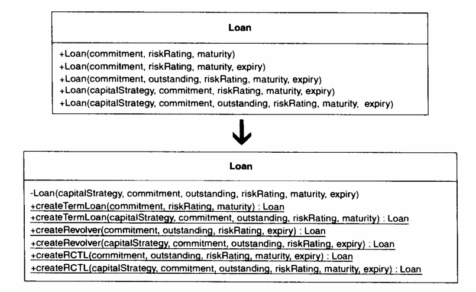

# 简单工厂模式

> 简单工厂模式，一般针对同一接口有多个实现类，使用统一的Factory来创建各种类型的实现类的情况。

其主要的优势在于，同一包中只暴露接口和工厂类，对每种接口的实现类可以不公开，客户端也不需要知道每一种实现类应该怎样创建。

优缺点：

✅ 简化不同类实例的创建

✅ 通过隐藏不需要的公开类减少包结构的认知难度

✅ 帮助严格执行“面向接口编程”

❌ 隐藏实现类之后，如果客户端需要对这些类做扩展，变得不那么容易

# 工厂方法模式

> 工厂方法模式在简单工厂模式的基础上添加，对每种Product提供一种工厂。

使用Factory Method并不会比直接new 或者 Creater Method更简单，但是这个模式在 Templete Method中却很有用。

优缺点：

✅ 减少因为创建自定义对象而产生重复代码

✅ 有效表达对象创建发生的位置，以及如何重写对象创建

✅ 强制Factory Method使用的类必须实现统一的类型

❌ 增加了更多的工厂类，使代码成倍数增加

# Creater模式

> 当面临一个类的构造方法有多个，不同的构造参数创建出不同的对象，当你在创建这样的对象时肯定是一头雾水，到底应该使用哪个构造方法？Creater Method就是为了解决这种场景

可以看到，使用`createXXX`的方式很接近构造方法加不同参数，那么使用`createXXX`的优势在哪里呢？

1. `createXXX`方式没有名称限制，不需要像构造方法必须跟类名相同。可以为创建对象赋予更明确意义
2. `createXXX`没有方法重载的限制，如果有参数相同可以直接取另外另外一个方法名
3. `createXXX`将对象的所有创建都收拢，当需要找某种创建方法时很容易找到。当某种创建方式不在使用时也可以很容易在找到，及时删除。

如果担心一个类中很多的`createrXXX`方法导致类职责不单一，可以将`createXXX`方法都移动到另外一个`XXXFactory`中，该类中只保留自己的属性和方法。注意这里的`XXXFactory`并不是简单工厂模式的`Factory`。因为对于工厂模式来说，我们要创建的都是接口的实现类，在`createXXX`中我们仅仅是创建本类的对象，为了收拢，为了命名清晰。