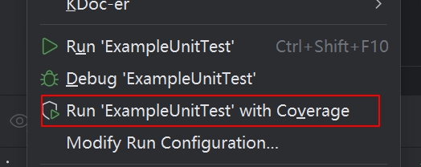
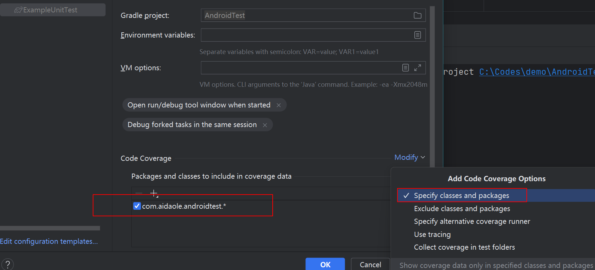

# 使用Robolectric做UnitTest

在Android UnitTest中，如果我们想测试Activity代码，那必须要构造一个Android虚拟环境来完成，Robolectric就用于此。它不想Expresso一样，需要结合ActivityScenarioRule使用真实的环境，所以写起单元测试来非常方便。

首先我们引入一些常用的单元测试依赖

```groovy
dependencies {
    testImplementation "junit:junit:4.13.2"
    testImplementation "org.robolectric:robolectric:4.11.1"
    testImplementation "androidx.test:core:1.5.0"
    testImplementation "org.mockito:mockito-core:5.3.1"
    testImplementation "org.mockito.kotlin:mockito-kotlin:5.1.0"
    testImplementation "io.mockk:mockk:1.13.9"
}
```

添加配置

```
android {
    testOptions {
        unitTests {
            includeAndroidResources = true
        }
    }
}
```

简单使用

```kotlin
@RunWith(RobolectricTestRunner::class)
@Config(shadows = [ShadowLog::class])
class ExampleUnitTest {

    private lateinit var app: Application

    @Before
    fun setUp() {
        ShadowLog.stream = System.out // 可将android的日志打印到命令行
        app = RuntimeEnvironment.getApplication() as Application
    }

    @Test
    fun testMainActivity(){
        val controller = buildActivity(MainActivity::class.java).setup().get()
        controller.findViewById<View>(R.id.test_T).performClick()
    }
}
```

这里我们就可以使用 `Run ExampleUnitTest` 跑单元测试了，上面的测试中会将 `MainActivity` 的生命周期 onCreate, onStart, onResume 都走一遍，并且测试按钮中点击也会覆盖。


## 遇到一个坑

这里有一个坑，我们如果想看覆盖率，这里选择



如果连着覆盖率跑单元测试，这里会报失败

```
Bad return type
Exception Details:
  Location:
    android/content/res/ResourcesImpl.$$robo$$android_content_res_ResourcesImpl$loadComplexColorForCookie(Landroid/content/res/Resources;Landroid/util/TypedValue;ILandroid/content/res/Resources$Theme;)Landroid/content/res/ComplexColor; @623: areturn
  Reason:
    Type 'java/lang/Object' (current frame, stack[0]) is not assignable to 'android/content/res/ComplexColor' (from method signature)
  Current Frame:
....
```

看日志是跑了 `android` 的真正库，但是由于我们使用的 虚拟环境，这里失败了。

解决方案，我们将跑覆盖率的测试配置修改一下：



只跑我们自己包名下的类，参考 [Coverage fails with Robolectric tests in AndroidStudio](https://github.com/robolectric/robolectric/issues/3023)