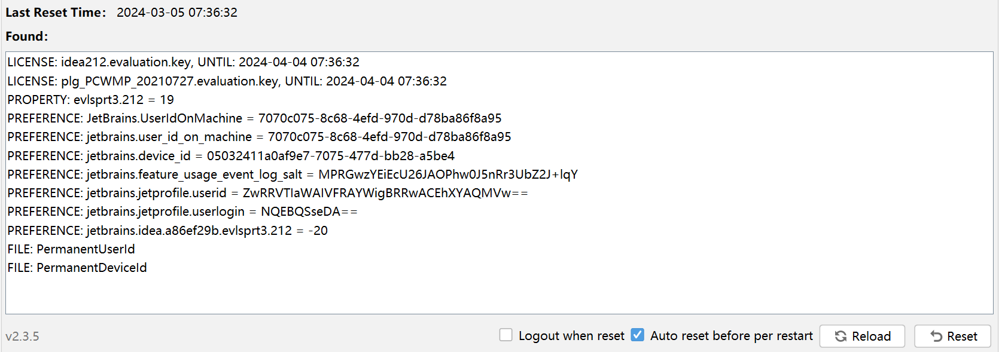

# IDEA全家桶激活

这里我们使用网上的一个idea插件，可以很轻松的无限试用idea全家桶

插件地址：[jetbrans-eval-reset插件](https://zhile.io/2020/11/18/jetbrains-eval-reset-deprecated.html)

声明：这个插件只用于学习

使用插件需要几点注意：

1. idea版本需要低于或等于 `2021.2.4` 版本
2. 如果之前已经过了试用期，需要卸载idea，重新安装一下，就可以重新开始试用
3. 将插件直接拖入idea进行安装即可，然后在 `Help->Eval Reset` 中重置试用

[安装包下载链接](images/idea_eval/ide-eval-resetter-2.3.5-c80a1d.zip)